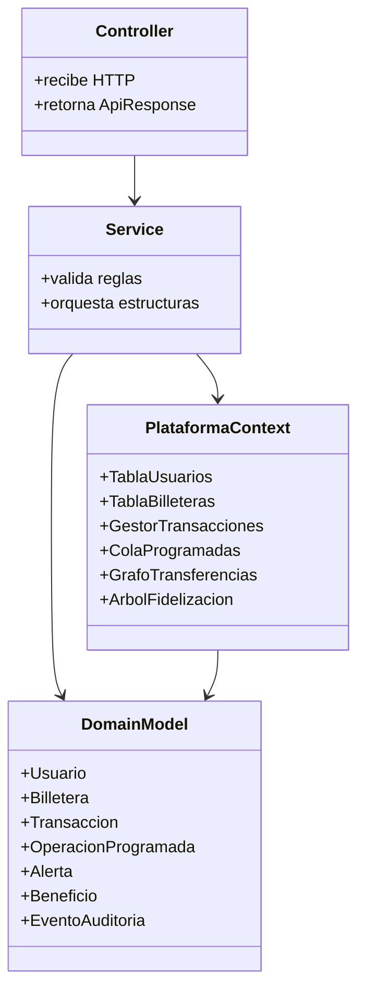

<div align="center">

```
███████╗██╗██████╗ ██╗      ██████╗  ██████╗    ███████╗ █████╗ ███████╗
╚══███╔╝██║██╔══██╗██║     ██╔═══██╗██╔════╝    ██╔════╝██╔══██╗██╔════╝
  ███╔╝ ██║██████╔╝██║     ██║   ██║██║         ███████╗███████║███████╗
 ███╔╝  ██║██╔═══╝ ██║     ██║   ██║██║         ╚════██║██╔══██║╚════██║
███████╗██║██║     ███████╗╚██████╔╝╚██████╗    ███████║██║  ██║███████║
╚══════╝╚═╝╚═╝     ╚══════╝ ╚═════╝  ╚═════╝    ╚══════╝╚═╝  ╚═╝╚══════╝
```

**Plataforma de Billeteras Digitales**


*Proyecto académico · Estructuras de Datos · 2026*

---

**Presentado por**

👤 Juan Esteban Galeano &nbsp;&nbsp;·&nbsp;&nbsp; 👤 Juan Steban Acosta

</div>

---

## ¿Qué es ZIPLOC SAS?

ZIPLOC SAS es una **plataforma completa de billeteras digitales** construida como proyecto académico para demostrar el uso correcto y eficiente de estructuras de datos implementadas desde cero. El backend está hecho en **Spring Boot** con persistencia en **MongoDB**, y el frontend en **React + Vite**.

El corazón del proyecto no es la base de datos: es la capa de estructuras propias en memoria que orquesta cada operación financiera en tiempo real.

```
  Usuario  ──▶  Frontend React  ──▶  API REST Spring Boot  ──▶  Estructuras en Memoria
                                                            └──▶  MongoDB (persistencia)
```

---

## Tabla de contenido

1. [Stack tecnológico](#stack-tecnológico)
2. [Arquitectura](#arquitectura)
3. [Estructuras de datos aplicadas](#estructuras-de-datos-aplicadas)
4. [Módulos del proyecto](#módulos-del-proyecto)
5. [Endpoints de la API](#endpoints-de-la-api)
6. [Guía rápida de uso](#guía-rápida-de-uso)
7. [Ejecutar el proyecto](#ejecutar-el-proyecto)

---

## Stack tecnológico

| Capa | Tecnología |
|---|---|
| Backend | Java 26 · Spring Boot 3 · Maven |
| Base de datos | MongoDB |
| Frontend | React 18 · Vite · Tailwind CSS |
| HTTP Client | Axios |
| Estructuras | Implementaciones propias (sin librerías externas) |

---

## Arquitectura

La aplicación sigue una **arquitectura por capas** diseñada para mantener separadas las responsabilidades y facilitar la demostración de cada estructura de datos.

```
HTTP Request
     │
     ▼
┌─────────────────┐
│   Controller    │  Recibe HTTP · Retorna ApiResponse
└────────┬────────┘
         │
         ▼
┌─────────────────┐
│    Service      │  Valida reglas · Orquesta estructuras
└────────┬────────┘
         │
   ┌─────┴──────┐
   ▼            ▼
┌──────────────────────┐     ┌─────────────────┐
│  PlataformaContext   │────▶│   DomainModel   │
│                      │     │                 │
│  TablaUsuarios       │     │  Usuario        │
│  TablaBilleteras     │     │  Billetera      │
│  GestorTransacciones │     │  Transaccion    │
│  ColaProgramadas     │     │  OperacionProg. │
│  GrafoTransferencias │     │  Alerta         │
│  ArbolFidelizacion   │     │  Beneficio      │
└──────────────────────┘     │  EventoAuditoria│
         │                   └─────────────────┘
         ▼
┌─────────────────┐
│    MongoDB      │  Persistencia entre reinicios
└─────────────────┘
```

### Diagrama de clases



### Flujo de una transferencia

```
Cliente
  │
  │  POST /api/transacciones/transferir
  ▼
TransaccionController
  │
  ▼
TransaccionService
  ├─▶ BilleteraService         → descuenta origen · suma destino
  ├─▶ GestorTransacciones      → registra historial · apila reversión
  ├─▶ GrafoTransferencias      → registra arista ponderada entre usuarios
  ├─▶ SistemaRecompensas       → calcula puntos · actualiza nivel
  ├─▶ EvaluadorRiesgo          → detecta patrones · registra auditoría
  └─▶ NotificacionService      → conserva alerta reciente por usuario
  │
  ▼
ApiResponse { ok, datos, mensaje }
```

### Decisiones de diseño

| Decisión | Justificación |
|---|---|
| Estructuras en memoria | Demostrar complejidades y comportamiento de cada estructura |
| MongoDB | Garantizar durabilidad del estado entre reinicios del servidor |
| `PlataformaContext` centralizado | Evita duplicar estado entre servicios |
| `@Service` de Spring | API REST limpia con inyección de dependencias estándar |
| Excepciones controladas | `ApiExceptionHandler` estandariza todos los errores de negocio |

---

## Estructuras de datos aplicadas

### 📋 Lista enlazada

**Usada en:** historial de transacciones por billetera, beneficios canjeados, operaciones procesadas y reportes por periodo.

**Justificación:** conserva orden cronológico y permite recorrer el historial completo para reportes y filtros.

```
[TX-001] → [TX-002] → [TX-003] → [TX-004]
 más antigua                      más reciente
```

| Operación | Complejidad |
|---|---|
| Insertar al final | O(1) |
| Recorrer historial | O(n) |
| Buscar por ID | O(n) |

---

### 📚 Pila — reversión de transacciones

`GestorTransacciones` mantiene una pila de transacciones reversibles.

**Justificación:** la operación más reciente se revierte en O(1), imitando un historial de deshacer.

```
      ┌──────────┐
 TOP  │  TX-004  │  ◀── revertir() actúa aquí
      ├──────────┤
      │  TX-003  │
      ├──────────┤
      │  TX-002  │
      ├──────────┤
      │  TX-001  │
      └──────────┘
```

---

### 🔄 Cola circular — notificaciones

`ColaNotificaciones` conserva las alertas recientes con capacidad máxima fija.

**Justificación:** limita memoria y descarta automáticamente la alerta más antigua cuando la cola está llena.

```
Capacidad = 5 · al insertar A6:
[A1][A2][A3][A4][A5]  →  [A2][A3][A4][A5][A6]
 ↑ descartado
```

---

### ⚡ Cola de prioridad — operaciones programadas

`ColaProgramadas` implementa un heap mínimo por fecha de ejecución y prioridad.

**Justificación:** siempre procesa la operación más urgente sin ordenar toda la cola en cada inserción.

```
         [08:00 · prio 1]   ◀── próxima
        /                 \
 [09:00 · prio 2]   [10:30 · prio 1]
       /
[12:00 · prio 3]
```

| Operación | Complejidad |
|---|---|
| Insertar | O(log n) |
| Extraer más urgente | O(log n) |
| Consultar más urgente | O(1) |

---

### 🌳 Árbol BST — fidelización

`ArbolFidelizacion` organiza usuarios por puntos acumulados.

**Justificación:** facilita reportes ordenados, top de puntos y búsquedas por rango.

```
              [Usuario C · 850 pts]
             /                     \
  [Usuario A · 420 pts]    [Usuario E · 1200 pts]
         \                         /
  [Usuario B · 610 pts]  [Usuario D · 990 pts]
```

---

### #️⃣ Tablas hash — usuarios y billeteras

| Estructura | Estrategia de colisión | Uso |
|---|---|---|
| `TablaUsuarios` | Encadenamiento separado | Búsqueda por ID de usuario |
| `TablaBilleteras` | Sondeo lineal | Consulta de saldo y actualizaciones |

```
TablaUsuarios (encadenamiento):        TablaBilleteras (sondeo lineal):
┌───┬─────────────────┐               ┌───┬──────────┐
│ 0 │ → [U-A] → [U-G] │               │ 0 │ [B-004]  │
│ 1 │ → [U-B]         │               │ 1 │ vacío    │
│ 2 │ vacío           │               │ 2 │ [B-001]  │
│ 3 │ → [U-C] → [U-F] │               │ 3 │ [B-007]  │
└───┴─────────────────┘               └───┴──────────┘
```

---

### 🕸️ Grafo — red de transferencias

`GrafoTransferencias` representa movimientos entre usuarios como aristas dirigidas y ponderadas por monto.

**Justificación:** permite analizar vecinos, montos, conexiones, ciclos y patrones de relación financiera.

```
  [Usuario A] ──$50.000──▶ [Usuario B]
       │                        │
  $20.000                   $80.000
       ▼                        ▼
  [Usuario C] ◀─$15.000── [Usuario D]
```

**Consultas disponibles:** vecinos directos · monto total entre nodos · detección de ciclos · usuarios más conectados

---

### 🔢 Estructuras ordenadas

`GestorTransacciones.obtenerMayoresValores` ordena el historial por valor para consultar las transacciones más altas, cubriendo el requisito de extraer operaciones de mayor valor.

---

## Módulos del proyecto

### Backend — Spring Boot

```
src/main/java/ZiplocSAS/
├── api/
│   ├── config/
│   │   ├── CorsConfig.java          # CORS para el frontend
│   │   └── package-info.java
│   ├── controller/                  # Endpoints REST
│   └── dto/                         # Objetos de entrada/salida
├── application/
│   └── service/                     # Reglas de negocio
├── domain/
│   ├── enums/                       # TipoTransaccion, EstadoTransaccion, etc.
│   ├── model/                       # Entidades de dominio
│   └── structures/                  # Lista · Pila · Colas · Árbol · Hash · Grafo
├── infrastructure/
│   ├── persistence/                 # Documentos MongoDB
│   ├── repository/                  # Spring Data repositories
│   └── scheduler/                   # Procesamiento automático de ColaProgramadas
└── ProyectoFinalApplication.java
```

### Frontend — React + Vite

```
ziplocSAS_Front/src/
├── api/                # Clientes HTTP hacia el backend
├── auth/               # Contexto de sesión y rutas protegidas
├── components/         # Componentes reutilizables de la UI
├── hooks/              # Custom hooks de React
├── interfaces/         # Tipos e interfaces
├── pages/              # Una página por vista (Usuarios, Billeteras, etc.)
├── services/           # obtenerBilleterasPorUsuario · obtenerTransacciones · etc.
├── styles/
│   ├── global.css
│   └── variables.css
├── App.jsx             # Enrutamiento principal
└── main.jsx            # Punto de entrada
```

### Enumeraciones del dominio

| Enum | Valores |
|---|---|
| `TipoTransaccion` | `RECARGA` · `RETIRO` · `TRANSFERENCIA` · `PAGO_PROGRAMADO` |
| `EstadoTransaccion` | `COMPLETADA` · `PENDIENTE` · `FALLIDA` · `PROCESANDO` |
| `NivelUsuario` | `BRONCE` · `PLATA` · `ORO` · `PLATINO` |
| `TipoBilletera` | `AHORRO` · `CORRIENTE` · `INVERSION` |

---

## Endpoints de la API

> Base URL: `http://localhost:8080/api`

### Usuarios
| Método | Ruta | Descripción |
|---|---|---|
| `POST` | `/usuarios` | Registrar usuario |
| `POST` | `/usuarios/login` | Autenticar usuario |
| `GET` | `/usuarios` | Listar todos |
| `GET` | `/usuarios/{id}` | Consultar por ID |
| `PUT` | `/usuarios/{id}` | Modificar |
| `DELETE` | `/usuarios/{id}` | Eliminar |
| `GET` | `/usuarios/ranking` | Top por puntos (árbol BST) |

### Billeteras
| Método | Ruta | Descripción |
|---|---|---|
| `POST` | `/billeteras` | Crear billetera |
| `GET` | `/billeteras/usuario/{usuarioId}` | Listar por usuario |
| `GET` | `/billeteras/{id}` | Consultar y ver saldo |
| `PUT` | `/billeteras/{id}` | Actualizar |
| `DELETE` | `/billeteras/{id}` | Eliminar |

### Transacciones
| Método | Ruta | Descripción |
|---|---|---|
| `POST` | `/transacciones/recargar` | Recargar saldo |
| `POST` | `/transacciones/retirar` | Retirar saldo |
| `POST` | `/transacciones/transferir` | Transferir entre billeteras |
| `GET` | `/transacciones/historial/{billeteraId}` | Ver historial |
| `POST` | `/transacciones/{id}/revertir` | Revertir (pila) |

### Operaciones programadas
| Método | Ruta | Descripción |
|---|---|---|
| `POST` | `/programadas` | Programar operación |
| `GET` | `/programadas` | Listar pendientes |
| `POST` | `/programadas/procesar` | Ejecutar vencidas (heap) |

### Recompensas
| Método | Ruta | Descripción |
|---|---|---|
| `GET` | `/recompensas/{usuarioId}` | Puntos y nivel actual |
| `POST` | `/recompensas/{usuarioId}/canjear` | Canjear beneficio |

### Notificaciones
| Método | Ruta | Descripción |
|---|---|---|
| `GET` | `/notificaciones/{usuarioId}` | Alertas recientes (cola circular) |
| `POST` | `/notificaciones/despachar` | Enviar alerta |
| `PUT` | `/notificaciones/{id}/leer` | Marcar como leída |

### Analítica
| Método | Ruta | Descripción |
|---|---|---|
| `GET` | `/analitica/reporte/{usuarioId}` | Reporte completo |
| `GET` | `/analitica/top-billeteras` | Mayor volumen |
| `GET` | `/analitica/usuarios-activos` | Más transacciones |
| `GET` | `/analitica/grafo/{usuarioId}` | Red de transferencias |
| `GET` | `/analitica/auditoria/{usuarioId}` | Eventos de auditoría |
| `GET` | `/analitica/rendimiento/{usuarioId}` | Métricas de rendimiento |

---

## Guía rápida de uso

### Crear usuario
```http
POST /api/usuarios
Content-Type: application/json

{
  "nombre": "Laura Gomez",
  "email": "laura@example.com",
  "contrasena": "secreto123",
  "telefono": "3001234567"
}
```

### Login
```http
POST /api/usuarios/login
Content-Type: application/json

{
  "email": "laura@example.com",
  "contrasena": "secreto123"
}
```

### Crear billetera
```http
POST /api/billeteras
Content-Type: application/json

{
  "nombre": "Ahorro",
  "tipo": "AHORRO",
  "saldo": 50000,
  "usuarioId": "USR-abc123"
}
```

### Transferir
```http
POST /api/transacciones/transferir
Content-Type: application/json

{
  "valor": 10000,
  "billeteraOrigenId": "BIL-origen",
  "billeteraDestinoId": "BIL-destino"
}
```

> La transferencia actualiza automáticamente el grafo, los puntos de fidelización y genera una notificación.

### Programar operación
```http
POST /api/programadas
Content-Type: application/json

{
  "fechaEjecucion": "2026-06-01T08:00:00",
  "tipo": "PAGO_PROGRAMADO",
  "valor": 15000,
  "billeteraOrigenId": "BIL-origen",
  "billeteraDestinoId": "BIL-destino",
  "prioridad": 1
}
```

### Revertir transacción
```http
POST /api/transacciones/{id}/revertir
```

### Consultar analítica
```http
GET /api/analitica/grafo/{usuarioId}
GET /api/analitica/reporte/{usuarioId}
GET /api/analitica/auditoria/{usuarioId}
```

---

## Ejecutar el proyecto

### Requisitos previos

- Java 26 (OpenJDK)
- Node.js 18+
- MongoDB corriendo en `localhost:27017`

### Backend

```powershell
$env:JAVA_HOME='C:\Users\Luich\.jdks\openjdk-26.0.1'
$env:Path="$env:JAVA_HOME\bin;$env:Path"
cmd /c mvnw.cmd spring-boot:run
```

El servidor arranca en → `http://localhost:8080`

### Frontend

```bash
cd ziplocSAS_Front
npm install
npm run dev
```

El cliente arranca en → `http://localhost:5173`

### Ejecutar pruebas

```powershell
$env:JAVA_HOME='C:\Users\Luich\.jdks\openjdk-26.0.1'
$env:Path="$env:JAVA_HOME\bin;$env:Path"
cmd /c mvnw.cmd test
```

---

## Resumen de estructuras

| Estructura | Clase | Complejidad clave |
|---|---|---|
| Lista enlazada | `ListaEnlazada<T>` | Inserción O(1) · Búsqueda O(n) |
| Pila | `PilaReversion` | Push/Pop O(1) |
| Cola circular | `ColaCircular<T>` | Inserción O(1) · Descarte O(1) |
| Heap mínimo | `ColaProgramadas` | Inserción O(log n) · Extracción O(log n) |
| Árbol BST | `ArbolFidelizacion` | Búsqueda O(log n) promedio |
| Hash encadenamiento | `TablaUsuarios` | Búsqueda O(1) promedio |
| Hash sondeo lineal | `TablaBilleteras` | Búsqueda O(1) promedio |
| Grafo dirigido ponderado | `GrafoTransferencias` | Vecinos O(grado del nodo) |

---

<div align="center">

Hecho con ☕ y muchas estructuras de datos

**Juan Esteban Galeano** · **Juan Steban Acosta**

*Estructuras de Datos · 2026*

</div>
