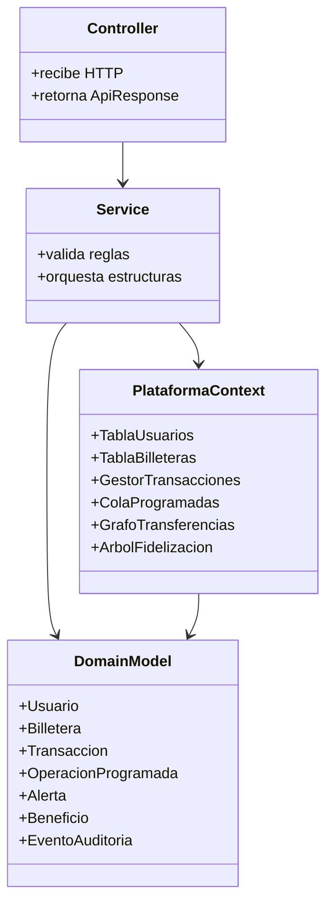

# ZIPLOC SAS — Plataforma de Billeteras Digitales

> **Proyecto académico** · Spring Boot · Estructuras de datos en memoria · REST API

---

## Tabla de contenido

1. [Descripción general](#descripción-general)
2. [Arquitectura](#arquitectura)
3. [Estructuras de datos aplicadas](#estructuras-de-datos-aplicadas)
4. [Módulos principales](#módulos-principales)
5. [Endpoints de la API](#endpoints-de-la-api)
6. [Guía rápida de uso](#guía-rápida-de-uso)
7. [Ejecutar y probar](#ejecutar-y-probar)

---

## Descripción general

**ZIPLOC SAS** es un backend académico construido con **Spring Boot** que simula una plataforma completa de billeteras digitales. Su objetivo principal no es conectarse a una base de datos relacional, sino demostrar el uso correcto y eficiente de estructuras de datos implementadas desde cero en memoria.

La plataforma cubre:

- Registro y autenticación de usuarios
- Creación y gestión de billeteras digitales
- Operaciones financieras: recarga, retiro, transferencia y reversión
- Operaciones programadas con cola de prioridad por fecha y urgencia
- Sistema de recompensas y niveles de fidelización
- Notificaciones y alertas por usuario
- Analítica de movimientos con grafos y reportes

---

## Arquitectura

La aplicación sigue una **arquitectura por capas** sencilla pensada para mantener separadas las responsabilidades del proyecto académico.

```
HTTP Request
     │
     ▼
┌─────────────────┐
│   Controller    │  Recibe HTTP · Retorna ApiResponse
└────────┬────────┘
         │
         ▼
┌─────────────────┐
│    Service      │  Valida reglas · Orquesta estructuras
└────────┬────────┘
         │
   ┌─────┴──────┐
   ▼            ▼
┌──────────────────────┐     ┌─────────────────┐
│  PlataformaContext   │────▶│   DomainModel   │
│                      │     │                 │
│  TablaUsuarios       │     │  Usuario        │
│  TablaBilleteras     │     │  Billetera      │
│  GestorTransacciones │     │  Transaccion    │
│  ColaProgramadas     │     │  OperacionProg. │
│  GrafoTransferencias │     │  Alerta         │
│  ArbolFidelizacion   │     │  Beneficio      │
└──────────────────────┘     │  EventoAuditoria│
                             └─────────────────┘
```

### Diagrama de clases (Mermaid)



### Flujo completo de una transferencia

```
Cliente
  │
  │  POST /api/transacciones/transferir
  ▼
TransaccionController
  │
  │  valida request y delega
  ▼
TransaccionService
  │  ├─ verifica billeteras, saldo y estado
  │  │
  │  ├─▶ BilleteraService
  │  │      └─ descuenta saldo origen · suma saldo destino
  │  │
  │  ├─▶ GestorTransacciones
  │  │      └─ registra historial · apila reversión
  │  │
  │  ├─▶ GrafoTransferencias
  │  │      └─ registra arista ponderada entre usuarios
  │  │
  │  ├─▶ SistemaRecompensas
  │  │      └─ calcula puntos · actualiza nivel del usuario
  │  │
  │  ├─▶ EvaluadorRiesgo
  │  │      └─ detecta patrones · registra auditoría si aplica
  │  │
  │  └─▶ NotificacionService
  │         └─ conserva alerta reciente por usuario
  │
  ▼
ApiResponse { ok, datos, mensaje }
```

### Decisiones de diseño

| Decisión | Justificación |
|---|---|
| Persistencia en memoria | El objetivo del proyecto es demostrar estructuras de datos, no una base de datos |
| `@Service` de Spring | Conserva una API REST limpia y permite inyección de dependencias estándar |
| `PlataformaContext` centralizado | Evita duplicar estado entre servicios; actúa como repositorio único en memoria |
| Excepciones controladas | `ApiExceptionHandler` captura y estandariza todos los errores de negocio |

---

## Estructuras de datos aplicadas

### Listas

**Usadas en:** historiales de transacciones por billetera, beneficios canjeados, operaciones procesadas y reportes por periodo.

**Justificación:** permiten conservar orden cronológico y recorrer el historial completo para reportes y filtros sin pérdida de información.

```
Historial de billetera B1:
[TX-001] → [TX-002] → [TX-003] → [TX-004]
 (más antigua)                    (más reciente)
```

---

### Pila — reversión de transacciones

`GestorTransacciones` mantiene una **pila de transacciones reversibles**.

**Justificación:** la operación más reciente puede revertirse en O(1), imitando un historial de deshacer exactamente igual que un editor de texto.

```
      ┌──────────┐
 TOP  │  TX-004  │  ◀── revertir() actúa aquí
      ├──────────┤
      │  TX-003  │
      ├──────────┤
      │  TX-002  │
      ├──────────┤
      │  TX-001  │
      └──────────┘
```

---

### Cola circular — notificaciones

`ColaNotificaciones` conserva las alertas recientes por usuario con **capacidad máxima fija**.

**Justificación:** limita el uso de memoria y descarta automáticamente la alerta más antigua cuando la cola está llena, sin intervención manual.

```
Capacidad = 5 alertas

[A1][A2][A3][A4][A5]
              ▲
              │ al insertar A6, A1 se descarta automáticamente
              │
[A2][A3][A4][A5][A6]
```

---

### Cola de prioridad — operaciones programadas

`ColaProgramadas` implementa un **heap mínimo** indexado por fecha de ejecución y prioridad.

**Justificación:** siempre procesa primero la operación programada más urgente sin necesidad de ordenar toda la cola en cada inserción.

```
         [fecha: 08:00, prio: 1]   ◀── próxima a ejecutar
        /                        \
[fecha: 09:00, prio: 2]   [fecha: 10:30, prio: 1]
       /
[fecha: 12:00, prio: 3]
```

| Operación | Complejidad |
|---|---|
| Insertar nueva operación | O(log n) |
| Extraer la más urgente | O(log n) |
| Consultar la más urgente | O(1) |

---

### Árbol — fidelización

`ArbolFidelizacion` organiza usuarios por puntos acumulados en un **árbol binario de búsqueda**.

**Justificación:** facilita reportes ordenados, consultas del top de puntos y búsquedas por rango sin recorrer la lista completa.

```
              [Usuario C · 850 pts]
             /                     \
  [Usuario A · 420 pts]    [Usuario E · 1200 pts]
         \                         /
  [Usuario B · 610 pts]  [Usuario D · 990 pts]
```

---

### Tablas hash — usuarios y billeteras

Dos implementaciones con estrategias de colisión distintas:

| Estructura | Estrategia de colisión | Uso |
|---|---|---|
| `TablaUsuarios` | Encadenamiento separado (listas enlazadas) | Búsqueda por ID de usuario |
| `TablaBilleteras` | Direccionamiento abierto con sondeo lineal | Consulta de saldo y actualizaciones frecuentes |

**Justificación:** aceleran búsquedas por identificador a O(1) promedio, esencial para operaciones financieras en tiempo real.

```
TablaUsuarios (encadenamiento):           TablaBilleteras (sondeo lineal):
┌────┬──────────────────┐                ┌────┬────────────┐
│  0 │ → [U-A] → [U-G]  │                │  0 │  [B-004]   │
│  1 │ → [U-B]          │                │  1 │  vacío     │
│  2 │ vacío            │                │  2 │  [B-001]   │
│  3 │ → [U-C] → [U-F]  │                │  3 │  [B-007]   │
│  4 │ → [U-D]          │                │  4 │  [B-002]   │
└────┴──────────────────┘                └────┴────────────┘
```

---

### Grafo — red de transferencias

`GrafoTransferencias` representa movimientos entre usuarios como **aristas dirigidas y ponderadas** por monto.

**Justificación:** permite analizar vecinos, montos transferidos, conexiones, ciclos y patrones de relación financiera entre usuarios.

```
  [Usuario A] ──── $50.000 ────▶ [Usuario B]
       │                              │
  $20.000                        $80.000
       │                              │
       ▼                              ▼
  [Usuario C] ◀─── $15.000 ─── [Usuario D]
```

**Consultas habilitadas por el grafo:**

- Vecinos directos de un usuario (a quién transfirió / de quién recibió)
- Monto total transferido entre dos nodos
- Detección de ciclos (transferencias circulares)
- Usuarios más conectados (analítica de red)

---

### Estructuras ordenadas — mayores valores

`GestorTransacciones.obtenerMayoresValores` ordena el historial por valor para consultar las transacciones más altas.

**Justificación:** cubre el requisito de extraer operaciones de mayor valor y deja la comparación clara para el informe técnico.

---

## Módulos principales

El proyecto está compuesto por dos aplicaciones independientes: el **backend** en Spring Boot y el **frontend** en React + Vite.

---

### Backend — Spring Boot (`ZiplocSAS`)

```
src/main/java/ZiplocSAS/
├── api/
│   ├── config/
│   │   ├── CorsConfig.java          # Configuración de CORS para el frontend
│   │   └── package-info.java
│   ├── controller/                  # Endpoints REST y manejo uniforme de errores
│   └── dto/                         # Objetos de entrada/salida de la API
│       └── package-info.java
├── application/
│   ├── service/                     # Reglas de negocio y coordinación de estructuras
│   └── package-info.java
├── domain/
│   ├── enums/                       # Estados, tipos y niveles (TipoTransaccion, etc.)
│   ├── model/                       # Entidades de dominio en memoria
│   ├── structures/                  # Implementaciones propias: lista, pila, colas,
│   │                                #   árbol, tablas hash y grafo
│   └── package-info.java
├── infrastructure/
│   ├── persistence/                 # Integración con MongoDB (repositorios)
│   ├── repository/                  # Interfaces de acceso a datos
│   ├── scheduler/                   # Procesamiento automático de operaciones programadas
│   └── package-info.java
├── package-info.java
└── ProyectoFinalApplication.java    # Punto de entrada de Spring Boot
```

#### Base de datos — MongoDB

La plataforma usa **MongoDB** como capa de persistencia real, gestionada desde el módulo `infrastructure`. Las estructuras de datos propias operan en memoria durante la sesión para máximo rendimiento, y el estado se sincroniza con MongoDB para garantizar durabilidad entre reinicios.

| Capa | Responsabilidad |
|---|---|
| `infrastructure/persistence/` | Documentos Mongo y mapeo de entidades |
| `infrastructure/repository/` | Repositorios Spring Data para CRUD |
| `infrastructure/scheduler/` | Tarea programada que procesa `ColaProgramadas` periódicamente |

---

### Frontend — React + Vite (`ziplocSAS_Front`)

```
ziplocSAS_Front/
├── src/
│   ├── api/                # Clientes HTTP (llamadas directas al backend)
│   ├── auth/               # Lógica de autenticación y contexto de sesión
│   ├── components/         # Componentes reutilizables de la UI
│   ├── hooks/              # Custom hooks de React
│   ├── interfaces/         # Tipos e interfaces TypeScript/JSDoc
│   ├── pages/              # Páginas completas (una por vista/ruta)
│   ├── services/           # Capa de servicios: obtenerBilleterasPorUsuario, etc.
│   ├── styles/
│   │   ├── global.css      # Estilos globales
│   │   └── variables.css   # Variables CSS del sistema de diseño
│   ├── App.jsx             # Enrutamiento principal
│   └── main.jsx            # Punto de entrada de React
├── .env                    # Variables de entorno (URL del backend, etc.)
├── index.html
├── tailwind.config.js      # Configuración de Tailwind CSS
├── postcss.config.js
└── vite.config.js          # Configuración del bundler Vite
```

#### Stack del frontend

| Herramienta | Uso |
|---|---|
| React + Vite | Framework y bundler principal |
| Tailwind CSS | Utilidades de estilo |
| `src/services/` | Funciones `obtenerBilleterasPorUsuario`, `obtenerTransaccionesPorBilletera`, `obtenerGrafoAnalitica`, etc. |
| `src/api/` | Instancias Axios / fetch configuradas con la base URL del backend |
| `src/auth/` | Contexto de usuario autenticado y rutas protegidas |

### Enumeraciones del dominio

| Enum | Valores |
|---|---|
| `TipoTransaccion` | `RECARGA`, `RETIRO`, `TRANSFERENCIA`, `PAGO_PROGRAMADO` |
| `EstadoTransaccion` | `COMPLETADA`, `PENDIENTE`, `FALLIDA`, `PROCESANDO` |
| `NivelUsuario` | `BRONCE`, `PLATA`, `ORO`, `PLATINO` |
| `TipoBilletera` | `AHORRO`, `CORRIENTE`, `INVERSION` |

---

## Endpoints de la API

El contexto base de todos los endpoints es `/api`.

### Usuarios — `/api/usuarios`

| Método | Ruta | Descripción |
|---|---|---|
| `POST` | `/api/usuarios` | Registrar nuevo usuario |
| `POST` | `/api/usuarios/login` | Autenticar usuario |
| `GET` | `/api/usuarios` | Listar todos los usuarios |
| `GET` | `/api/usuarios/{id}` | Consultar usuario por ID |
| `PUT` | `/api/usuarios/{id}` | Modificar datos del usuario |
| `DELETE` | `/api/usuarios/{id}` | Eliminar usuario |
| `GET` | `/api/usuarios/ranking` | Top de usuarios por puntos (árbol) |

### Billeteras — `/api/billeteras`

| Método | Ruta | Descripción |
|---|---|---|
| `POST` | `/api/billeteras` | Crear billetera |
| `GET` | `/api/billeteras/usuario/{usuarioId}` | Listar billeteras de un usuario |
| `GET` | `/api/billeteras/{id}` | Consultar billetera y saldo |
| `PUT` | `/api/billeteras/{id}` | Actualizar billetera |
| `DELETE` | `/api/billeteras/{id}` | Eliminar billetera |

### Transacciones — `/api/transacciones`

| Método | Ruta | Descripción |
|---|---|---|
| `POST` | `/api/transacciones/recargar` | Recargar saldo en billetera |
| `POST` | `/api/transacciones/retirar` | Retirar saldo de billetera |
| `POST` | `/api/transacciones/transferir` | Transferir entre billeteras |
| `GET` | `/api/transacciones/historial/{billeteraId}` | Historial de transacciones |
| `POST` | `/api/transacciones/{id}/revertir` | Revertir última transacción (pila) |

### Operaciones programadas — `/api/programadas`

| Método | Ruta | Descripción |
|---|---|---|
| `POST` | `/api/programadas` | Programar nueva operación |
| `GET` | `/api/programadas` | Listar operaciones pendientes |
| `POST` | `/api/programadas/procesar` | Procesar operaciones cuya fecha ya venció |

### Recompensas — `/api/recompensas`

| Método | Ruta | Descripción |
|---|---|---|
| `GET` | `/api/recompensas/{usuarioId}` | Consultar puntos y nivel actual |
| `POST` | `/api/recompensas/{usuarioId}/canjear` | Canjear beneficio disponible |

### Notificaciones — `/api/notificaciones`

| Método | Ruta | Descripción |
|---|---|---|
| `GET` | `/api/notificaciones/{usuarioId}` | Listar alertas recientes (cola circular) |
| `POST` | `/api/notificaciones/despachar` | Enviar notificación manual |
| `PUT` | `/api/notificaciones/{id}/leer` | Marcar alerta como leída |

### Analítica — `/api/analitica`

| Método | Ruta | Descripción |
|---|---|---|
| `GET` | `/api/analitica/reporte/{usuarioId}` | Reporte completo del usuario |
| `GET` | `/api/analitica/top-billeteras` | Billeteras con mayor volumen |
| `GET` | `/api/analitica/usuarios-activos` | Usuarios con más transacciones |
| `GET` | `/api/analitica/grafo/{usuarioId}` | Red de transferencias del usuario |
| `GET` | `/api/analitica/auditoria/{usuarioId}` | Eventos de auditoría |
| `GET` | `/api/analitica/rendimiento/{usuarioId}` | Métricas de rendimiento |

---

## Guía rápida de uso

### 1. Crear usuario

```http
POST /api/usuarios
Content-Type: application/json

{
  "nombre": "Laura Gomez",
  "email": "laura@example.com",
  "contrasena": "secreto123",
  "telefono": "3001234567"
}
```

**Respuesta esperada:**
```json
{
  "ok": true,
  "datos": {
    "id": "USR-abc123",
    "nombre": "Laura Gomez",
    "email": "laura@example.com",
    "nivel": "BRONCE",
    "puntos": 0
  }
}
```

---

### 2. Login

```http
POST /api/usuarios/login
Content-Type: application/json

{
  "email": "laura@example.com",
  "contrasena": "secreto123"
}
```

---

### 3. Crear billetera

```http
POST /api/billeteras
Content-Type: application/json

{
  "nombre": "Ahorro",
  "tipo": "AHORRO",
  "saldo": 50000,
  "usuarioId": "USR-abc123"
}
```

**Tipos disponibles:** `AHORRO`, `CORRIENTE`, `INVERSION`

---

### 4. Recargar saldo

```http
POST /api/transacciones/recargar
Content-Type: application/json

{
  "valor": 20000,
  "billeteraDestinoId": "BIL-xyz789"
}
```

---

### 5. Retirar saldo

```http
POST /api/transacciones/retirar
Content-Type: application/json

{
  "valor": 5000,
  "billeteraOrigenId": "BIL-xyz789"
}
```

---

### 6. Transferir entre billeteras

```http
POST /api/transacciones/transferir
Content-Type: application/json

{
  "valor": 10000,
  "billeteraOrigenId": "BIL-origen",
  "billeteraDestinoId": "BIL-destino"
}
```

> La transferencia actualiza el grafo de relaciones, calcula puntos de fidelización y genera una alerta de notificación automáticamente.

---

### 7. Revertir última transacción

```http
POST /api/transacciones/{id}/revertir
```

Extrae la transacción del tope de la pila de reversión y deshace el movimiento de saldo. Solo aplica a transacciones marcadas como reversibles.

---

### 8. Programar una operación futura

```http
POST /api/programadas
Content-Type: application/json

{
  "fechaEjecucion": "2026-05-12T08:00:00",
  "tipo": "PAGO_PROGRAMADO",
  "valor": 15000,
  "billeteraOrigenId": "BIL-origen",
  "billeteraDestinoId": "BIL-destino",
  "prioridad": 1
}
```

El campo `prioridad` determina el orden dentro de operaciones con la misma fecha. Valor más bajo = mayor urgencia.

---

### 9. Procesar operaciones pendientes

```http
POST /api/programadas/procesar
```

Extrae del heap mínimo todas las operaciones cuya `fechaEjecucion` ya venció y las ejecuta en orden de prioridad.

---

### 10. Consultar analítica

```http
# Reporte general del usuario
GET /api/analitica/reporte/{usuarioId}

# Billeteras con mayor volumen de operaciones
GET /api/analitica/top-billeteras

# Usuarios más activos en la plataforma
GET /api/analitica/usuarios-activos

# Grafo de transferencias: vecinos, montos y conexiones
GET /api/analitica/grafo/{usuarioId}

# Registro de eventos de auditoría
GET /api/analitica/auditoria/{usuarioId}

# Métricas de rendimiento de operaciones
GET /api/analitica/rendimiento/{usuarioId}
```

---

## Ejecutar y probar

### Requisitos

- Java 26 (OpenJDK)
- Maven Wrapper incluido (`mvnw`)

### Iniciar el servidor

```powershell
$env:JAVA_HOME='C:\Users\Luich\.jdks\openjdk-26.0.1'
$env:Path="$env:JAVA_HOME\bin;$env:Path"
cmd /c mvnw.cmd spring-boot:run
```

El servidor inicia en `http://localhost:8080` por defecto.

### Ejecutar pruebas

```powershell
$env:JAVA_HOME='C:\Users\Luich\.jdks\openjdk-26.0.1'
$env:Path="$env:JAVA_HOME\bin;$env:Path"
cmd /c mvnw.cmd test
```

### Probar con curl

```bash
# Registrar usuario
curl -X POST http://localhost:8080/api/usuarios \
  -H "Content-Type: application/json" \
  -d '{"nombre":"Laura Gomez","email":"laura@example.com","contrasena":"secreto123","telefono":"3001234567"}'

# Consultar grafo de un usuario
curl http://localhost:8080/api/analitica/grafo/USR-abc123
```

---

## Resumen de estructuras y su ubicación en el código

| Estructura | Clase | Módulo | Complejidad clave |
|---|---|---|---|
| Lista enlazada | `ListaEnlazada<T>` | `domain.structures` | Inserción O(1), búsqueda O(n) |
| Pila | `PilaReversion` | `domain.structures` | Push/pop O(1) |
| Cola circular | `ColaCircular<T>` | `domain.structures` | Inserción O(1), descarte O(1) |
| Heap mínimo | `ColaProgramadas` | `domain.structures` | Inserción O(log n), extracción O(log n) |
| Árbol BST | `ArbolFidelizacion` | `domain.structures` | Búsqueda O(log n) promedio |
| Hash (encadenamiento) | `TablaUsuarios` | `domain.structures` | Búsqueda O(1) promedio |
| Hash (sondeo lineal) | `TablaBilleteras` | `domain.structures` | Búsqueda O(1) promedio |
| Grafo dirigido ponderado | `GrafoTransferencias` | `domain.structures` | Vecinos O(grado del nodo) |

---

*ZIPLOC SAS · Proyecto académico · Estructuras de Datos · 2026*
